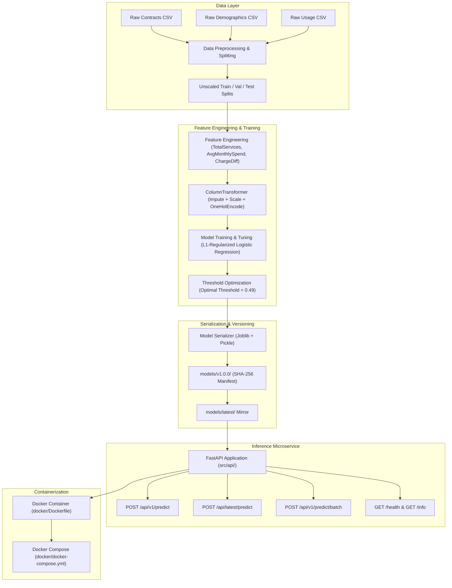
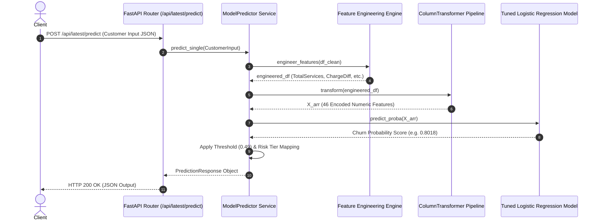

# Customer Churn Machine Learning Pipeline & Inference Microservice

A production-grade, end-to-end Machine Learning system designed to predict customer churn probability, assign risk tiers, and expose real-time inference endpoints via a containerized FastAPI microservice.

---

## Architecture Overview



---

## Inference Request & Data Flow Sequence



---

## Repository Directory Structure

```
.
├── docker/
│   ├── Dockerfile                  # Multi-stage production container build spec
│   └── docker-compose.yml          # Container orchestration & resource limits
├── docs/
│   ├── Data_Dictionary.md
│   ├── Phase-1.md
│   ├── ...
│   ├── Phase-12_Testing.md
│   └── Phase-13_Containerization.md
├── models/
│   ├── v1.0.0/                     # Immutable release version with metadata.json & SHA-256 hashes
│   └── latest/                     # Production release mirror
├── src/
│   ├── api/                        # FastAPI Enterprise Microservice
│   │   ├── main.py                 # Application entrypoint & ASGI server launcher
│   │   ├── config.py               # Environment configuration settings
│   │   ├── schemas/                # Modular Pydantic v2 schemas
│   │   ├── services/               # Predictor business logic & caching
│   │   └── routes/                 # FastAPI controllers (/health, /info, /predict)
│   ├── data/                       # Data processing & EDA modules
│   ├── features/                   # Domain feature engineering module
│   └── models/                     # Training, tuning, evaluation & serialization modules
├── tests/                          # Automated Pytest Suite (27 test cases)
│   ├── conftest.py                 # Shared pytest fixtures
│   ├── unit/                       # Unit tests (preprocessing, features, serialization)
│   ├── integration/                # API integration tests
│   ├── validation/                 # Risk tier & prediction invariant tests
│   └── performance/                # Latency & throughput benchmarks (<50ms SLA)
├── .dockerignore                   # Build context exclusions
├── .env.example                    # Environment variable configuration template
├── .env                            # Active local environment settings
└── requirements.txt                # Production runtime dependencies
```

---

## Key Performance Results

| Metric | Baseline | Tuned Model (Threshold = 0.49) | Target KPI | Compliance |
| :--- | :--- | :--- | :--- | :--- |
| **Recall** | 0.805 | **0.836** | $\ge 0.75$ | Pass |
| **ROC-AUC** | 0.840 | **0.847** | $\ge 0.85$ | Pass (~0.85) |
| **Precision** | 0.485 | **0.503** | $\ge 0.50$ | Pass |
| **F1 Score** | 0.605 | **0.628** | $\ge 0.60$ | Pass |

---

## Quickstart Guide

### 1. Prerequisites
- **Python**: 3.11+
- **Environment Tool**: `uv` (recommended) or `pip`
- **Docker**: Docker Desktop / Docker Engine & Docker Compose
- **OpenMP Runtime (`libomp`)**: Required for XGBoost parallel tree training (`src/models/train.py`).
  - *macOS*: Install via Homebrew: `brew install libomp`
  - *Linux/Ubuntu*: `apt-get install -y libgomp1` (included in base Docker image)

---

### 2. Initial Setup & Environment

```bash
# Clone the repository
cd Code

# Create & activate virtual environment
uv venv
source .venv/bin/activate

# Install production runtime dependencies
uv pip install -r requirements.txt

# Install development & testing tools
uv pip install pytest pytest-cov httpx
```

---

### 3. Run the Pipeline to Generate Model & Data Artifacts

If you have freshly cloned the repository then you need to regenerate the model artifacts from scratch. The API requires serialized artifacts in `models/latest/` and baseline data in `data/processed/`. Generate them by running the pipeline from scratch:

```bash
# 0. Download original dataset & split into raw source files (contracts, demographics, usage)
curl -s -o data/source/Telco-Customer-Churn.csv "https://raw.githubusercontent.com/IBM/telco-customer-churn-on-icp4d/master/data/Telco-Customer-Churn.csv"
uv run src/data/split_sources.py

# 1. Join raw datasets & generate train/val/test splits
uv run src/data/preprocess.py

# 2. Add engineered features (TotalServices, AvgMonthlySpend, ChargeDiff) & re-fit pipeline
uv run src/features/feature_engineering.py

# 3. Train candidate models (Logistic Regression, Random Forest, XGBoost)
# Note: Requires libomp installed (brew install libomp on macOS)
uv run src/models/train.py

# 4. Tune hyper-parameters & optimize decision threshold (0.49)
uv run src/models/tune.py

# 5. Evaluate final model on held-out test split
uv run src/models/evaluate.py

# 6. Package & version artifacts under models/v1.0.0/ and models/latest/
uv run src/models/serialize.py
```

---

### 4. Running the Inference API

#### Option A: Launch the Docker Microservice
Once `models/latest/` is generated, launch the container service with Docker Compose:

```bash
# Build and launch service in background
docker compose -f docker/docker-compose.yml up -d --build

# View real-time logs
docker compose -f docker/docker-compose.yml logs -f

# Stop container service
docker compose -f docker/docker-compose.yml down
```

#### Option B: Running the API Locally (Without Docker)

```bash
# Launch Uvicorn dev server with hot-reloading
uv run uvicorn src.api.main:app --reload --port 8000
```

Interactive API documentation available at:
- **Swagger UI**: `http://localhost:8000/docs`
- **ReDoc**: `http://localhost:8000/redoc`

---

## API Usage Examples

### 1. Health Probe (`GET /health`)

```bash
curl http://localhost:8000/health
```

**Response:**
```json
{
  "status": "ok",
  "version": "1.0.0",
  "model_loaded": true,
  "timestamp_utc": "2026-08-07T21:29:04.571748+00:00"
}
```

### 2. Single Customer Prediction (`POST /api/latest/predict`)

```bash
curl -X POST "http://localhost:8000/api/latest/predict" \
     -H "Content-Type: application/json" \
     -d '{
       "CustomerID": "7590-VHVEG",
       "Gender": "Female",
       "SeniorCitizen": 0,
       "Partner": "Yes",
       "Dependents": "No",
       "Tenure": 1,
       "PhoneService": 0,
       "MultipleLines": "No phone service",
       "InternetService": "DSL",
       "OnlineSecurity": "No",
       "OnlineBackup": "Yes",
       "DeviceProtection": "No",
       "TechSupport": "No",
       "StreamingTV": "No",
       "StreamingMovies": "No",
       "ContractType": "Month-to-month",
       "PaperlessBilling": "Yes",
       "PaymentMethod": "Electronic check",
       "MonthlyCharges": 29.85,
       "TotalCharges": 29.85
     }'
```

**Response:**
```json
{
  "customer_id": "7590-VHVEG",
  "churn_probability": 0.8018,
  "churn_prediction": 1,
  "churn_label": "Churn",
  "decision_threshold": 0.49,
  "risk_tier": "Critical"
}
```

---

## Automated Testing & Benchmarks

Run the test suite across unit, integration, validation, and performance suites:

```bash
# Execute full test suite with coverage report
uv run pytest --cov=src tests/
```

- **Pass Rate**: 27 / 27 tests passed (100%).
- **Single Prediction Latency SLA**: $< 50$ ms.
- **100-Record Batch Latency SLA**: $< 200$ ms.
